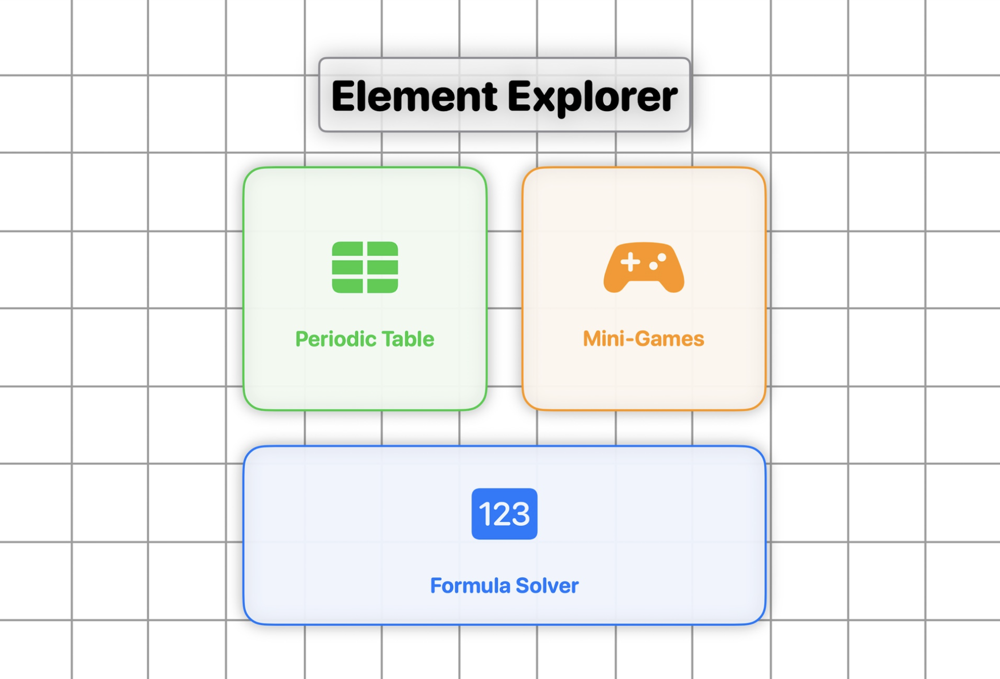
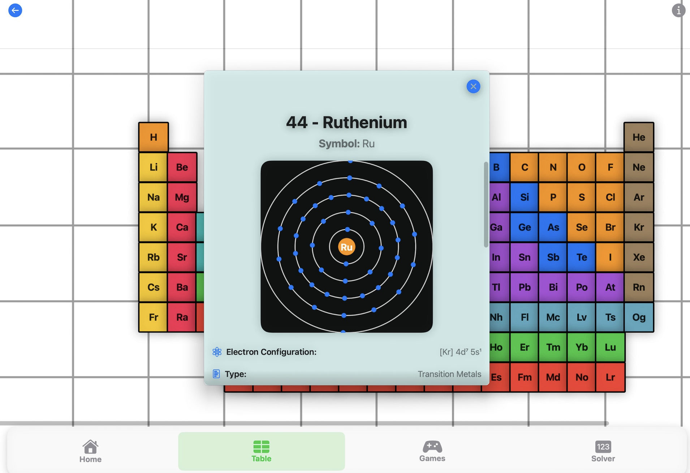
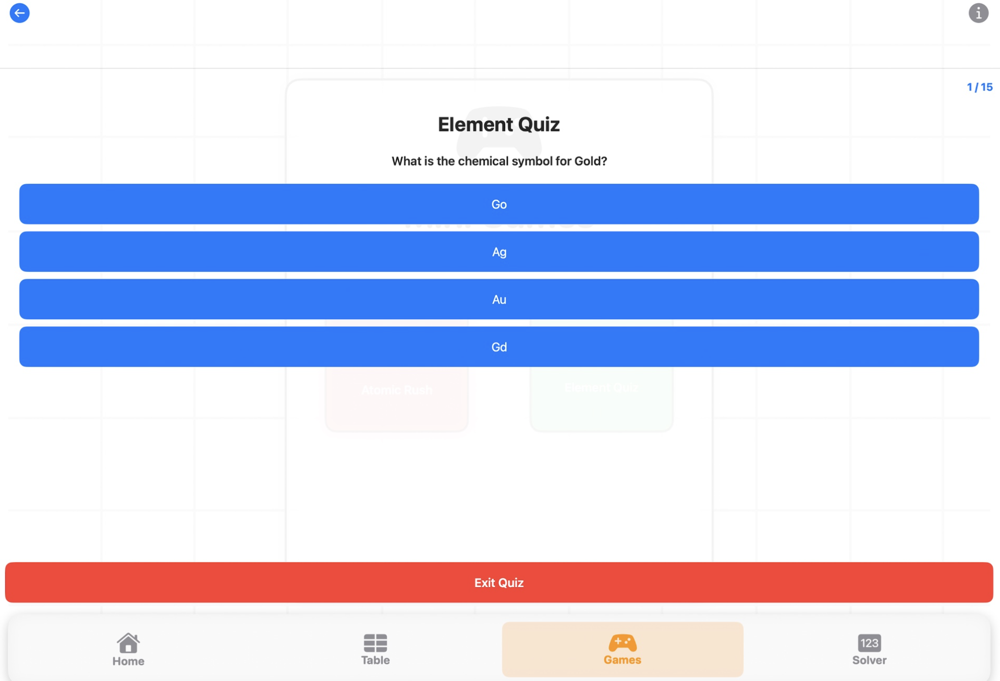
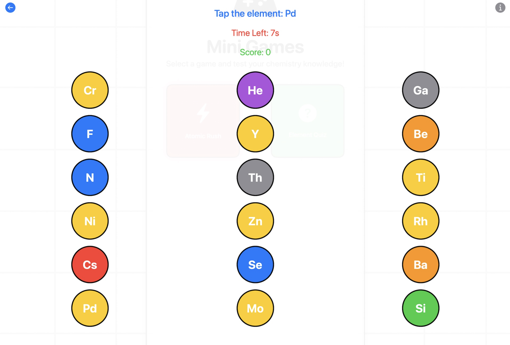
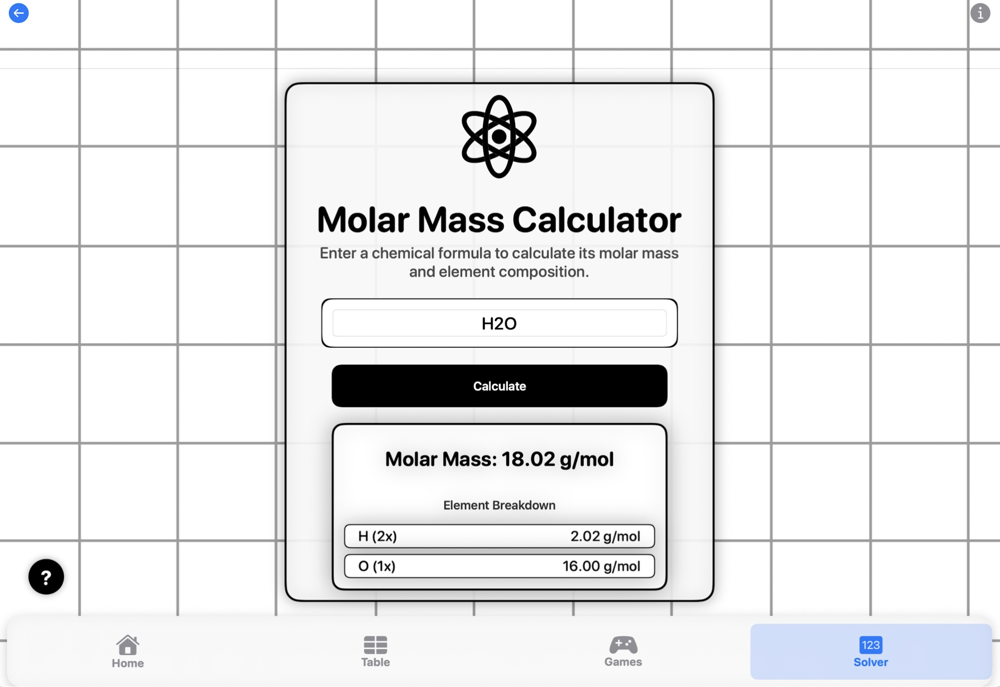

# Element Explorer

Element Explorer is a fun, interactive app that reimagines the periodic table. Tap into each element to see animated orbitals, quick facts, and real-world uses. Test yourself with quizzes, try a mix-and-match game to form compounds, or use the formula calculator to check equations.

## Status
First female winner in Australia for the **Apple Swift Student Challenge 2025**.

## Features
- **Interactive Periodic Table**: Tap elements to explore animated orbitals, properties, and uses.
- **Quizzes & Games**: Reinforce learning with quizzes and a mix-and-match game to build compounds.
- **Formula Calculator**: Input and validate chemical formulas or equations.
- **Educational Focus**: Designed to make chemistry visual, intuitive, and engaging for students.

<table>
  <tr>
    <td rowspan="2" valign="top">
      
    </td>
    <td></td>
    <td></td>
  </tr>
  <tr>
    <td></td>
    <td></td>
  </tr>
</table>

## Purpose
Created as an educational app for students to learn chemistry in a fun and interactive way. Perfect for anyone curious about how elements work in the real world.

## Tech Stack
- **Frontend**: SwiftUI (iPad app)
- **Logic/Backend**: Custom algorithms for formula validation
- **Design**: Interactive, student-focused UI/UX
